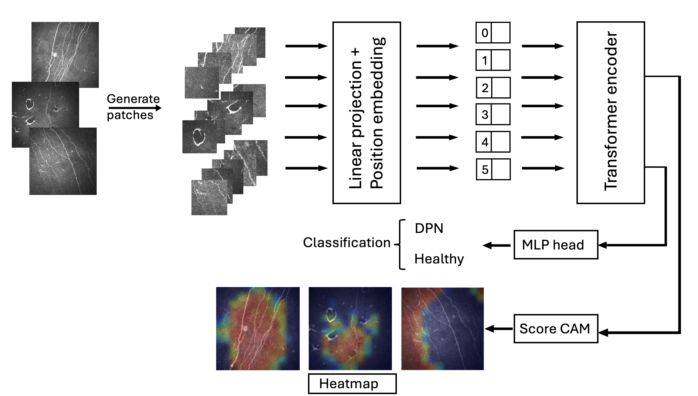

# ViT-CCM

## 🌟 Overview 

Early detection and management of diabetic peripheral neuropathy (DPN) are critical to reducing associated morbidity and mortality. Corneal Confocal Microscopy (CCM) facilitates the imaging of corneal nerves to detect early and progressive nerve damage in DPN. However, its wider adoption has been limited by the subjectivity and time-intensive nature of manual nerve fiber quantification. This code investigates the diagnostic utility of state-of-the-art Vision Transformer (ViT) models for the binary classification of CCM images to distinguish between healthy controls and individuals with DPN. 



##😊 Citation

If you used this code, please cite our paper in your work:

``@article{ben4vision,
  title={Vision Transformers for Automated Detection of Diabetic Peripheral Neuropathy in Corneal Confocal Microscopy Images},
  author={Ben Rabah, Chaima and Petropoulos, Ioannis Nikolaos and Malik, Rayaz A and Serag, Ahmed},
  journal={Frontiers in Imaging},
  volume={4},
  pages={1542128},
  publisher={Frontiers}
}
```

## ⬇️  Requirements  

This code workers under python version 3.11.9

> * tensorflow                   2.16.2
> * keras                            3.4.1
> * numpy                          1.26.4
> * opencv-python            4.10.0.84
> * matplotlib                     3.9.0
> * scipy                             1.14.0
> * scikit-learn                    1.5.0
> * tqdm                              4.66.4
